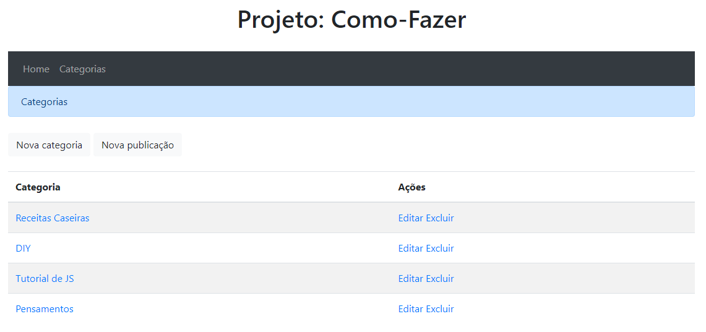

# Projeto "como-fazer"

Esse exemplo de site em Javascript implementando CRUD foi criado a partir de um workshop promovido pelo canal do YouTube [DevPleno](https://www.youtube.com/channel/UC07JWf9A0B1scApbS1Te7Ww) intitulado "Fullstack Lab".

Esse site apresenta a possibilidade do usuário criar **Categorias** de assuntos e adicionar **Publicações** dentro de cada uma das categorias criadas. Também é possível editar e excluir as **Categorias** e **Publicações**.

### Rodando o projeto 🏃🏼

- Para instalar as dependências: `npm install`

- Para executar o projeto: `npm run start`

### Validando a formatação do código 🔍

- Para checar quais arquivos não estão seguindo as formatações padrão: `npm run lint:check`

- Para corrigir a formatação nos arquivos necessários: `npm run lint:fix`

### Rodando os testes 🧪

- 🚧Em construção🚧

## 🚧 TO DO 🚧

- [x] adicionar .nvmrc
- [x] adicionar prettier
- [x] adicionar README.md
- [ ] adicionar testes unitários e de integração
- [ ] melhorar usabilidade entre telas
- [ ] adicionar validação que pergunta se usuário tem certeza de que deseja excluir algum item
